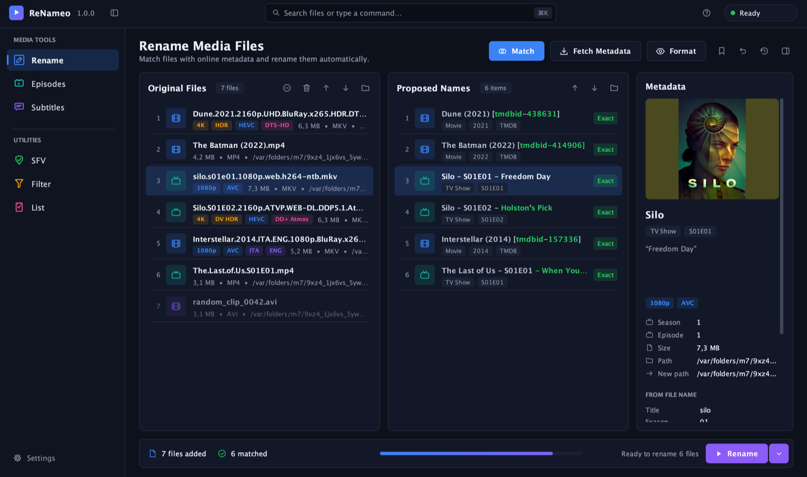
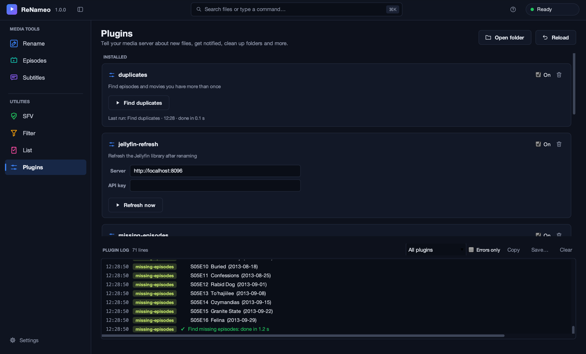
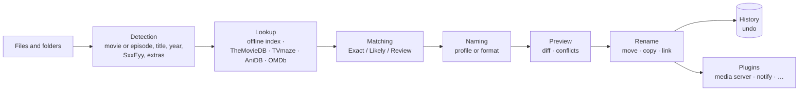

<p align="center">
  
</p>

<h1 align="center">ReNameo</h1>

<p align="center">
  <b>Clean, consistent names for your movies, TV shows, anime, music and subtitles.</b><br>
  Ready for Plex, Jellyfin, Emby and Kodi. On macOS, Linux, Windows and Docker.
</p>

<p align="center">
  <a href="https://github.com/m4st3r-0day/ReNameo/actions/workflows/ci.yml"></a>
  
  
  <a href="LICENSE.md"></a>
</p>

<p align="center">
  
</p>

## Contents

- [What it does](#what-it-does)
- [Install](#install) · [API keys](#api-keys) · [Quick start](#quick-start)
- [Naming profiles](#naming-profiles) · [Custom formats](#custom-formats) · [Subtitles](#subtitles)
- [Watch folder](#watch-folder) · [Plugins and scripts](#plugins-and-scripts) · [Command line](#command-line) · [Docker and TrueNAS](#docker-and-truenas)
- [How it works](#how-it-works) · [Troubleshooting](#troubleshooting) · [Documentation](#documentation)
- [Building from source](#building-from-source) · [Credits and license](#credits-and-license)

## What it does

Drop a download folder on ReNameo, press **Match**, check the preview, press **Rename**:

```
Before                                                          After
Downloads/                                                      Downloads/
└─ Neagley.S01.1080p.AMZN.WEB-DL.DDP5.1.Atmos.H265-TBK/         └─ Neagley (2026)/
   ├─ Neagley.S01E01.1080p.AMZN.WEB-DL…mkv                         ├─ Season 01/
   ├─ Neagley.S01E02.1080p.AMZN.WEB-DL…mkv                         │  ├─ Neagley (2026) - S01E01 - L Train.mkv
   ├─ Neagley.S01E02.1080p.AMZN.WEB-DL….ita.srt                    │  ├─ Neagley (2026) - S01E02 - Team Building Exercises.mkv
   └─ Neagley.S01.1080p-TBK.nfo                                    │  └─ Neagley (2026) - S01E02 - Team Building Exercises.ita.srt
                                                                   └─ Neagley.S01.1080p-TBK.nfo
```

**Recognition**
- Movies, series and anime from **TheMovieDB**, **TVmaze**, **AniDB** and **OMDb**; music from **AcoustID** and ID3 tags.
- Release names are understood: resolution, source, codecs, HDR / Dolby Vision, audio, languages and release groups are recognized and left out of the search.
- The title your library already uses wins: an Italian or original title in the folder name is preferred over the English one, helped by an offline index of popular titles (*Il Trono di Spade* → *Game of Thrones*).
- **Extras** (deleted scenes, featurettes, interviews, trailers…) stay with their movie instead of becoming "part 2". Long-running shows with 100+ seasons or 1000+ episodes work too.

**Renaming**
- Side-by-side **preview** with a confidence level for every match (Exact, Likely, Review), conflict detection and a dry run.
- **Undo** with ⌘Z and a persistent **history**, also after a restart.
- **Naming profiles** for Plex, Jellyfin, Emby and Kodi that tidy up in place, or your own **format** with a live editor.
- Move, copy, hard link, symlink or clone. Subtitles follow their video, posters and fanart on request.
- A **watch folder** that renames new downloads on its own, in the app or in Docker.

**And also**
- **Plugins**: refresh your media server, get a notification, clean up download leftovers, find missing episodes or duplicates. One click to install, or write your own.
- Episode lists, subtitle search and download, SFV / MD5 / SHA-1 checksums, a media file filter.
- Dark and light themes, inspector with poster and technical badges, command palette (⌘K), built-in guide in English and Italian (F1).

## Install

**macOS (Apple Silicon, macOS 11+):** download **ReNameo-1.0.0-mac-arm64.dmg** from the [latest release](https://github.com/m4st3r-0day/ReNameo/releases/latest), open it and drag **ReNameo** to Applications. ReNameo isn't notarized by Apple, so the first time open **System Settings → Privacy & Security** and click **Open Anyway**, or run `xattr -dr com.apple.quarantine /Applications/ReNameo.app`. For the command line: `sudo ln -s /Applications/ReNameo.app/Contents/MacOS/ReNameo /usr/local/bin/renameo`.

**Linux, Windows and Docker:** packages will follow in a later release. Until then, [build from source](#building-from-source):

| System | Build | Then |
| --- | --- | --- |
| Ubuntu / Debian (x86_64, arm64) | `tools/package.sh deb` | `sudo apt install ./dist/packages/renameo_*.deb` |
| Windows 10/11 (x64) | `tools/package.sh msi` | run the installer in `dist\packages` |
| Docker / NAS | `docker build -t renameo .` | see [Docker and TrueNAS](#docker-and-truenas) |

Every package brings its own Java runtime. Optional: [MediaInfo](https://mediaarea.net/en/MediaInfo) adds resolution, codec and audio details (`brew install libmediainfo` on macOS; the Linux package and the Docker image include it).

## API keys

ReNameo looks titles up on TheMovieDB, which needs a free personal API key: create an account on [themoviedb.org](https://www.themoviedb.org/signup) and copy the **API Key** from [Settings → API](https://www.themoviedb.org/settings/api).

The app asks for it on first start, checks it right away and keeps it in the macOS Keychain. The same window takes optional keys for OMDb, Fanart.tv and AcoustID (**Settings → API keys**). On servers, in Docker or in scripts use environment variables: `TMDB_API_KEY`, `OMDB_API_KEY`, `FANARTTV_API_KEY`, `ACOUSTID_API_KEY`.

## Quick start

1. Drag files or folders onto **Original Files**.
2. Press **Match**: ReNameo works out movie or episode and picks the database.
3. Check the names on the right. Anything uncertain is highlighted; **Manual match** fixes it.
4. Press **Rename**. The preview shows every change before it happens.

Changed your mind? **⌘Z**, or undo an earlier rename from the history.

## Naming profiles

**⌄ → Naming Profile** picks a ready-made convention. Plex, Jellyfin, Emby and Kodi **tidy up in place**, as in the example above:

- the folder of a series or movie gets its proper name, *Name (Year)*, where it is;
- episodes go into their season folder, and an existing `Season 1` is reused;
- the rest of the folder (`.nfo`, samples, other seasons) follows, and the old folder goes away;
- a file loose in a general folder like `Downloads` only gets a new name.

| Profile | Episode | Movie |
| --- | --- | --- |
| Plex | `Silo (2023) - S01E01 - Freedom Day.mkv` | `Dune (2021) {tmdb-438631}.mkv` |
| Jellyfin | `Silo (2023) - S01E01 - Freedom Day.mkv` | `Dune (2021) [tmdbid-438631].mkv` |
| Emby | `Silo (2023) - S01E01 - Freedom Day.mkv` | `Dune (2021) [tmdbid=438631].mkv` |
| Kodi | `Silo (2023) - S01E01 - Freedom Day.mkv` | `Dune (2021).mkv` |

*Windows-friendly* and *macOS-friendly* only rename the file, with characters both systems accept.

## Custom formats

**Format** opens an editor with a live preview. Text inside `{…}` is replaced with data about the file; everything else is kept as written.

| Format | Result |
| --- | --- |
| `{n} ({y})` | `Dune (2021)` |
| `{n} - {s00e00} - {t}` | `Silo - S01E01 - Freedom Day` |
| `{n}/Season {s.pad(2)}/{n} - {s00e00} - {t}` | `Silo/Season 01/Silo - S01E01 - Freedom Day` |
| `{n} ({y}) [{vf} {vc}]` | `Dune (2021) [2160p HEVC]` |
| `{jellyfin.tidy}` | what the Jellyfin profile does: folder renamed in place, season folders |
| `{jellyfin.name}` | only the file name, the file stays where it is |
| `/Volumes/Media/{jellyfin}` | a complete library: `Shows/Silo (2023) [tmdbid-125988]/Season 01/…` under `/Volumes/Media` |
| `{jellyfin.library('/Volumes/Media/TV')}` | into an existing library, reusing the folders already there |

Common bindings: `{n}` name, `{y}` year, `{t}` episode title, `{s}` / `{e}` season / episode, `{s00e00}`, `{vf}` resolution, `{vc}` / `{ac}` video / audio codec, `{lang}`, `{tmdbid}`, `{imdbid}`, `{genre}`, `{extra}`. The [user guide](docs/USER_GUIDE_GUI.md#custom-formats) lists them all.

## Subtitles

ReNameo uses the **opensubtitles.com** REST API:

1. Create a free account on [opensubtitles.com](https://www.opensubtitles.com/en/users/sign_up) and a free API key under [API consumers](https://www.opensubtitles.com/en/consumers).
2. In the **Subtitles** tab, press the user button and enter the API key, username and password.

The password stays in the macOS Keychain. Free accounts have a daily download quota, shown after you sign in.

## Watch folder

**Settings → Watch folder** picks a folder (e.g. Downloads), the naming profile and the action. While ReNameo is open, new video, audio and subtitle files there are renamed every few minutes; files changed in the last 2 minutes are left alone so downloads can finish. Everything goes into the history. For a server that runs around the clock, use the [Docker watch mode](docker/README.md).

## Plugins and scripts

<p align="center">
  
</p>

The **Plugins** page installs ready-made plugins with one click and holds their settings, actions, progress and log:

| Plugin | What it does |
| --- | --- |
| `jellyfin-refresh`, `emby-refresh` | Rescan the library after renaming |
| `plex-refresh` | Rescan only the Plex folders that received files |
| `kodi-scan` | Update the Kodi video library |
| `notify` | Message on ntfy, Discord, Gotify or Pushover |
| `clutter-cleaner` | Trash samples and leftovers, remove empty download folders |
| `subtitles-all` | Missing subtitles for a whole folder, or after every rename |
| `missing-episodes` | Aired episodes missing from a series folder |
| `duplicates` | Episodes and movies you have more than once |
| `rename-log` | Every rename in a text file |

Plugins are short Groovy files, so writing your own is easy:

```groovy
description "Refresh the Jellyfin library after renaming"
setting "server", "Server", "http://localhost:8096"   // a field on the Plugins page
secret  "apiKey", "API key"                           // same, masked

onRenameBatch { renames -> log "${renames.size()} files renamed" }   // app, watch folder, command line, Docker
binding("quality") { m -> m.height >= 2000 ? "4K" : "HD" }         // {plugin.quality} in formats
action("Count videos") { folder -> progress 1, 10, "…" }           // a button with a progress bar
```

**Scripts** are run when you want: `renameo -script fn:sort-downloads ~/Downloads`. The guide to [writing plugins and scripts](docs/USER_GUIDE_PLUGINS.md) ([in italiano](docs/GUIDA_PLUGIN.md)) walks through complete examples. Plugins and scripts run with your rights, so only install the ones you trust; formats stay sandboxed.

## Command line

The app is also a command line tool:

```bash
# tidy up release folders in place, test first
renameo -rename -r ~/Downloads --format "{jellyfin.tidy}" --action test -non-strict

# sort downloads into a Jellyfin library
renameo -rename -r ~/Downloads --naming jellyfin --output /Volumes/Media -non-strict

# Italian subtitles, undo, media info, checksums
renameo -get-subtitles ~/Movies/Dune --lang it
renameo -revert ~/Movies/Dune
renameo -mediainfo ~/Movies/Dune
renameo -check ~/Music/album
```

`renameo -help` lists every option; the [command line guide](docs/USER_GUIDE_CLI.md) has the full reference.

## Docker and TrueNAS

```bash
docker build -t renameo .     # the image isn't published yet, build it from this repository
docker run --rm -e TMDB_API_KEY=your-key -v /path/to/media:/media \
  renameo -rename /media/downloads -r --action test -non-strict
```

The image also has a **watch mode** for downloads, with `PUID`/`PGID`, settings and history in `/config`, hard links for seeding and plugins via `RENAMEO_PLUGINS`. The [Docker guide](docker/README.md) covers every option, `docker-compose.yml` and installing on **TrueNAS SCALE**.

## How it works



1. **Detection.** File and folder names tell movie or episode, title, year, season and episode, and whether it's an extra. Release tags are recognized and left out of the search.
2. **Lookup.** The offline index answers popular titles instantly; the online databases do the rest. Answers are cached.
3. **Matching.** Each file gets the best result and a confidence level; episodes are aligned by number, air date or absolute number.
4. **Naming and preview.** The new name comes from the profile or format. Nothing is touched before you confirm.
5. **Rename, history, plugins.** Every operation is recorded and can be undone; plugins react to what was renamed.

## Troubleshooting

| Problem | Solution |
| --- | --- |
| macOS says the app "is damaged" or can't be opened | **System Settings → Privacy & Security → Open Anyway**, or run `xattr -dr com.apple.quarantine /Applications/ReNameo.app` |
| Nothing is found | Check the TheMovieDB key in **Settings → API keys** (it is the short *API Key*, not the long *Read Access Token*) |
| Resolution or codecs are empty in formats | Install MediaInfo (`brew install libmediainfo`) |
| Wrong match | Select the file → **Manual match**, or add the year to the search |
| Renamed by mistake | ⌘Z, the history, or `renameo -revert <folder>` |
| Where are settings, history and plugins? | `~/.renameo` (macOS), `~/.local/share/renameo` (Linux), `%APPDATA%\ReNameo` (Windows), `/config` (Docker) |

## Documentation

| | English | Italiano |
| --- | --- | --- |
| Desktop app | [User guide](docs/USER_GUIDE_GUI.md) | [Guida](docs/GUIDA_GUI.md) |
| Command line | [CLI guide](docs/USER_GUIDE_CLI.md) | [Guida CLI](docs/GUIDA_CLI.md) |
| Plugins and scripts | [Writing plugins and scripts](docs/USER_GUIDE_PLUGINS.md) | [Creare plugin e script](docs/GUIDA_PLUGIN.md) |
| Docker and TrueNAS | [Docker guide](docker/README.md) | |

The same guides are built into the app (**Help → User Guide**, or F1).

## Building from source

You need JDK 21 and [Apache Ant](https://ant.apache.org) (`brew install ant`).

```bash
export JAVA_HOME=$(/usr/libexec/java_home -v 21)
ant resolve          # first time only: download the libraries
ant fatjar           # dist/ReNameo_1.0.0.jar
tools/make-app.sh    # dist/ReNameo.app with its own Java runtime, plus .zip and .dmg
open dist/ReNameo.app
```

Other platforms: `tools/package.sh deb` on Linux (needs fakeroot), `tools/package.sh msi` on Windows (needs the WiX Toolset), `docker build -t renameo .` for the image. `tools/run-tests.sh` runs the tests; GitHub Actions builds and tests every push on Linux, macOS and Windows, and a tag like `v1.1.0` publishes packages and the Docker image.

To build API keys into your own copy, copy `profile.properties.example` to `profile.properties` and fill it in (it is never committed). Without it, the app asks for the keys on first start.

<details>
<summary>More developer tools and the project layout</summary>

- `./renameo.sh` runs the jar directly (GUI), `./renameo.sh -help` the command line.
- `python3 tools/md2html.py` regenerates the built-in help after editing `docs/*.md`.
- `python3 tools/build_index.py` rebuilds the offline title index in `data/` (needs `TMDB_API_KEY`).
- `tools/bash_completion.d/renameo` adds bash completion.

```
source/net/renameo/   application code (ui/ app, cli/ command line, web/ services, media/ detection, plugins/ plugins and catalog)
test/                 unit tests (JUnit 4)
docs/                 user guides (English and Italian), images, plugin example
data/                 offline title indexes and release data, bundled into the jar
docker/               Docker entrypoint, docker-compose example and guide
packaging/            icons and launcher settings for macOS, Linux and Windows
tools/                build, packaging and test scripts
.github/workflows/    CI and release automation
```

</details>

## Credits and license

ReNameo is built on the open source code of **FileBot 4.8.0** © Reinhard Pointner, used under the *Modified Don't Be A Dick Public License* (see [LICENSE.md](LICENSE.md)), and has since been extensively reworked: new interface, recognition, matching and naming, media server profiles, plugins, the OpenSubtitles REST client, the preview / undo / history workflow and builds for every platform. The ideas for some ready-made plugins come from the [FileBot scripts](https://github.com/filebot/scripts); their code is written from scratch.

Metadata and images come from [TheMovieDB](https://www.themoviedb.org), [TVmaze](https://www.tvmaze.com), [AniDB](https://anidb.net), [OMDb](https://www.omdbapi.com), [Fanart.tv](https://fanart.tv), [AcoustID](https://acoustid.org) and [OpenSubtitles](https://www.opensubtitles.com). ReNameo is not endorsed or certified by any of them.
