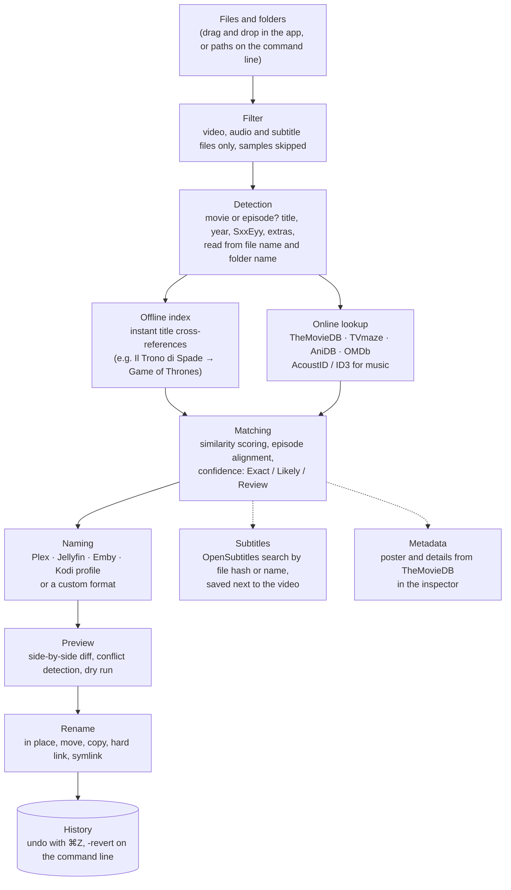

# ReNameo

[](https://github.com/m4st3r-0day/ReNameo/actions/workflows/ci.yml)

**A modern media renamer for macOS, Linux, Windows and Docker.** ReNameo matches your movies, TV shows, anime, music and subtitles against online databases and gives them clean, consistent names that Plex, Jellyfin, Emby and Kodi recognize.


ReNameo started from the open source code of FileBot 4.8.0 and has since been extensively reworked. It has a new interface, new matching and naming logic, media server profiles and support for current web APIs.

- [Features](#features)
- [How it works](#how-it-works)
- [Requirements](#requirements)
- [Install](#install)
- [API keys](#api-keys)
- [Quick start](#quick-start)
- [Naming profiles](#naming-profiles)
- [Custom formats](#custom-formats)
- [Subtitles (OpenSubtitles)](#subtitles-opensubtitles)
- [Watch folder](#watch-folder)
- [Plugins and scripts](#plugins-and-scripts)
- [Command line](#command-line)
- [Docker and TrueNAS](#docker-and-truenas)
- [Building from source](#building-from-source)
- [Project layout](#project-layout)
- [Credits and license](#credits-and-license)

## Features

**Recognition**
- Movies, TV series and anime from **TheMovieDB**, **TVmaze**, **AniDB** and **OMDb**, and music from **AcoustID** and ID3 tags.
- Smart parsing of release names: resolution, source, codecs, HDR / Dolby Vision, audio, languages and release groups are detected and ignored when searching.
- It keeps the title your library already uses: an Italian or original title in the folder name is preferred over the English one.
- Long running shows are supported: more than 100 seasons, more than 1000 episodes, and `S101E01` / `S2010E05` patterns.
- **Extras** are recognized: deleted scenes, featurettes, behind the scenes, interviews, trailers and shorts. They are attributed to their movie, not renamed as "part 2".
- A local offline index of popular titles gives instant cross-references (e.g. *Il Trono di Spade* → *Game of Thrones*). It can be refreshed from the app.

**Renaming**
- Side-by-side **diff view** of the original and proposed names, with a confidence state for each match (Exact, Likely, Review).
- **Preview** before applying, **conflict detection** (duplicates and existing files), and **dry run**.
- **Undo** with ⌘Z, plus a persistent rename **history**, also after a restart.
- **Naming profiles** for Plex, Jellyfin, Emby and Kodi, plus Windows- and macOS-safe names.
- A **pattern editor** with live preview, and **presets** that store format, source, language and action together.
- **Manual match** when the automatic one is wrong, and batch actions on the selection.
- Rename or move, copy, hard link, symlink and clone. Subtitles are paired with their video.
- A **watch folder** renames what arrives in Downloads on its own, in the app or in Docker.
- A **poster preview** before artwork is downloaded.

**Interface**
- Dark and light themes, a collapsible sidebar and a compact mode.
- An **inspector** with poster, metadata and technical badges (4K, HDR, HEVC, DTS-HD, languages, …).
- A **command palette** (⌘K), keyboard shortcuts, and progress and notifications inside the main window.
- A built-in user guide in English and Italian (F1).

**Other tools**
- Episode lists, subtitle search and download, SFV / MD5 / SHA-1 checksums, a file filter, and list renaming.
- **Plugins**: Groovy scripts that react to every rename (e.g. refresh Jellyfin or Plex) or add values to formats.

## How it works



1. **Filter.** Only media files are kept: video, audio and subtitles. Samples and other files are ignored.
2. **Detection.** ReNameo reads the file name and its folder to work out whether it is a movie or an episode, plus the title, year, season and episode numbers, and whether it is an extra (deleted scene, trailer, …). Release tags such as resolution, codecs and release group are recognized and left out of the search.
3. **Lookup.** The title is looked up in the offline index and in the online databases. Responses are cached, so running again is fast.
4. **Matching.** Each file is paired with the best result. Episodes are aligned by season and episode number, air date or absolute number. Every match gets a confidence level (Exact, Likely or Review), and the ones marked Review are highlighted for you to check.
5. **Naming and preview.** The new name comes from the chosen naming profile or custom format. You see every change before anything is touched, including conflicts such as two files with the same target or a file that already exists.
6. **Rename and history.** Files are renamed with the chosen action. Every operation is recorded, so it can be undone even after a restart.

## Requirements

- **macOS** 11 or later on Apple Silicon, **Linux** (x86_64 or arm64, e.g. Ubuntu 22.04+), **Windows** 10/11 (x64) or **Docker**. Java is bundled with every package, nothing else to install.
- Optional: [MediaInfo](https://mediaarea.net/en/MediaInfo) for resolution, codec and audio bindings. The Linux package and the Docker image install it automatically; on macOS:
  ```bash
  brew install libmediainfo
  ```

## Install

Download the package for your system from the [Releases](https://github.com/m4st3r-0day/ReNameo/releases) page.

| System | Package | Command line |
| --- | --- | --- |
| macOS | `ReNameo-mac-arm64.dmg`: open it and drag **ReNameo.app** to Applications. The app is ad-hoc signed, so the first time right-click it and choose **Open**. | `sudo ln -s /Applications/ReNameo.app/Contents/MacOS/ReNameo /usr/local/bin/renameo` |
| Ubuntu / Debian | `renameo_<version>_amd64.deb`: `sudo apt install ./renameo_*.deb` | `sudo ln -s /opt/renameo/bin/ReNameo /usr/local/bin/renameo` |
| Windows | `ReNameo-<version>.msi`: run the installer. | `renameo.exe` in the installation folder |
| Docker / NAS | `ghcr.io/m4st3r-0day/renameo`, see [Docker and TrueNAS](#docker-and-truenas) | |

## API keys

ReNameo looks up titles on TheMovieDB, which needs a free personal API key. Create an account on [themoviedb.org](https://www.themoviedb.org/signup), then copy the **API Key** from [Settings → API](https://www.themoviedb.org/settings/api).

On first start the app asks for it. The key is checked right away and stored in the macOS Keychain. The same window takes optional keys for OMDb, Fanart.tv and AcoustID, and you can reopen it from **Settings → API keys**.

On servers, in Docker or in scripts, pass the keys as environment variables: `TMDB_API_KEY`, `OMDB_API_KEY`, `FANARTTV_API_KEY` and `ACOUSTID_API_KEY`.

## Quick start

1. Drag files or folders onto **Original Files**.
2. Press **Match**. ReNameo detects whether each file is a movie or an episode and picks the database.
3. Check the proposed names on the right. Anything uncertain is highlighted, and you can fix it with **Manual match**.
4. Press **Rename**. A preview shows every change before it is applied.

Did something go wrong? Press **⌘Z**, or open the history to undo an earlier rename.

## Naming profiles

**⌄ → Naming Profile** switches between ready-made conventions. Plex, Jellyfin, Emby and Kodi **tidy up in place**: the folder of a series or movie gets its proper name (`Neagley.S01.1080p.WEB-DL-TBK` → `Neagley (2024)`), episodes go into `Season 01`, and the rest of the folder follows. A file loose in a general folder like `Downloads` only gets a new name. In formats this is `{jellyfin.tidy}`; `{jellyfin.name}` renames just the file.

| Profile | Episode | Movie |
| --- | --- | --- |
| Plex | `Silo (2023) - S01E01 - Freedom Day.mkv` | `Dune (2021) {tmdb-438631}.mkv` |
| Jellyfin | `Silo (2023) - S01E01 - Freedom Day.mkv` | `Dune (2021) [tmdbid-438631].mkv` |
| Emby | `Silo (2023) - S01E01 - Freedom Day.mkv` | `Dune (2021) [tmdbid=438631].mkv` |
| Kodi | `Silo (2023) - S01E01 - Freedom Day.mkv` | `Dune (2021).mkv` |

To build a complete library instead (folders per movie, series and season), use a custom format with `{plex}`, `{jellyfin}`, `{emby}` or `{kodi}`, as described below.

## Custom formats

**Format** opens an editor with a live preview. Text inside `{…}` is replaced with data about the file; everything else is kept as written.

| Format | Result |
| --- | --- |
| `{n} ({y})` | `Dune (2021)` |
| `{n} - {s00e00} - {t}` | `Silo - S01E01 - Freedom Day` |
| `{n}/Season {s.pad(2)}/{n} - {s00e00} - {t}` | `Silo/Season 01/Silo - S01E01 - Freedom Day` |
| `{n} ({y}) [{vf} {vc}]` | `Dune (2021) [2160p HEVC]` |
| `{jellyfin.name}` | the Jellyfin file name only, the file stays where it is |
| `/Volumes/Media/{jellyfin}` | `Shows/Silo (2023) [tmdbid-125988]/Season 01/…` under `/Volumes/Media` |
| `{jellyfin.library('/Volumes/Media/TV')}` | moves into an existing library and reuses the folders already there (`Season 1`, `01. Silo (2023)`) |

Common bindings are `{n}` name, `{y}` year, `{t}` episode title, `{s}` / `{e}` season / episode, `{s00e00}`, `{sxe}`, `{absolute}`, `{vf}` resolution, `{vc}` / `{ac}` video / audio codec, `{lang}`, `{tmdbid}`, `{imdbid}`, `{genre}`, `{director}`, `{rating}`, `{extra}` and `{extraTitle}`. The [user guide](docs/USER_GUIDE_GUI.md#custom-formats) lists them all.

## Subtitles (OpenSubtitles)

ReNameo uses the current **opensubtitles.com** REST API. The legacy opensubtitles.org API no longer accepts new applications. To download subtitles:

1. Create a free account on [opensubtitles.com](https://www.opensubtitles.com/en/users/sign_up).
2. Create a free API key under [API consumers](https://www.opensubtitles.com/en/consumers).
3. In the **Subtitles** tab, press the user button and enter the API key, your username and your password.

The password is stored in the macOS Keychain. Free accounts have a daily download quota, which ReNameo shows after you sign in. The API does not allow uploads from applications, so upload subtitles on the website.

## Watch folder

**Settings → Watch folder** picks a folder (e.g. Downloads), the names (Plex, Jellyfin, Emby, Kodi) and the action (move, copy, hard link, symlink). While ReNameo is open, new video, audio and subtitle files there are renamed every few minutes. Files changed in the last 2 minutes are left alone, so downloads can finish, and files that can't be matched are not retried until they change. Every rename goes into the history and can be undone.

For a server or NAS that runs around the clock, use the [Docker watch mode](docker/README.md) instead.

## Plugins and scripts

The **Plugins** page in the sidebar installs ready-made plugins with one click, turns them on and off, holds their settings (server, API key, …), runs their actions and shows what they write to the log:

| Plugin | What it does |
| --- | --- |
| `jellyfin-refresh`, `emby-refresh` | Rescan the library after renaming |
| `plex-refresh` | Rescan only the Plex folders that received files |
| `kodi-scan` | Update the Kodi video library (JSON-RPC) |
| `notify` | Message on ntfy, Discord, Gotify or Pushover after renaming |
| `clutter-cleaner` | Trash samples, `.nfo`, `.txt` … and remove the empty download folders after files were moved |
| `subtitles-all` | Missing subtitles for a whole folder, or automatically after renaming |
| `missing-episodes` | Aired episodes that are missing from a series folder (TheMovieDB) |
| `duplicates` | Episodes and movies you have more than once |
| `rename-log` | Every rename in a text file |

Plugins are Groovy scripts in the `plugins` folder of the ReNameo data folder (`~/.renameo/plugins` on macOS, `~/.local/share/renameo/plugins` on Linux, `%APPDATA%\ReNameo\plugins` on Windows, `/config/plugins` in Docker), so you can also write your own:

```groovy
description "Refresh the Jellyfin library after renaming"
setting "server", "Server", "http://localhost:8096"   // a field on the Plugins page, read with settings.server
secret "apiKey", "API key"                            // same, masked

onRename { from, to -> log "renamed ${from.name}" }   // after every rename: app, watch folder, command line, Docker
onRenameBatch { renames -> /* once per batch */ }     // renames = [[from, to], ...]
binding("resolution") { m -> m.height >= 2000 ? "4K" : "HD" }   // {plugin.resolution} in formats
action("Count videos", "…") { folder -> /* a button on the Plugins page */ }
```

Step by step, with complete examples: [writing plugins and scripts](docs/USER_GUIDE_PLUGINS.md) ([in italiano](docs/GUIDA_PLUGIN.md)), also under Help in the app. A short example with every instruction is in [`docs/plugins/example.groovy`](docs/plugins/example.groovy). In Docker, `RENAMEO_PLUGINS=jellyfin-refresh,notify` installs plugins and `PLUGIN_<NAME>_<SETTING>` sets their settings (e.g. `PLUGIN_JELLYFIN_REFRESH_APIKEY`). Plugins run with your rights, so only install plugins you trust. Formats themselves stay sandboxed: they can't run programs or change files.

The ideas for the ready-made plugins come from the [FileBot scripts](https://github.com/filebot/scripts); the code is written from scratch for ReNameo.

**Scripts** run once from the command line: `renameo -script my-script.groovy`, or `renameo -script fn:name` for `name.groovy` in the `scripts` folder of the data folder.

## Command line

The app bundle is also a command line tool:

```bash
# rename a TV show in place, test only
renameo -rename ~/Downloads/Silo --db TheMovieDB::TV --action test -non-strict

# sort downloads into a Jellyfin library
renameo -rename -r ~/Downloads --naming jellyfin --output /Volumes/Media -non-strict

# rename movies with a custom format
renameo -rename ~/Movies --db TheMovieDB --format "{n} ({y})/{n} ({y}) [{vf}]"

# fetch Italian subtitles
renameo -get-subtitles ~/Movies/Dune --lang it

# undo the last renames, print media info, check checksums
renameo -revert ~/Movies/Dune
renameo -mediainfo ~/Movies/Dune
renameo -check ~/Music/album
```

Run `renameo -help` for all options. The full reference with more examples is in the [command line guide](docs/USER_GUIDE_CLI.md).

## Docker and TrueNAS

```bash
docker run --rm -e TMDB_API_KEY=your-key -v /path/to/media:/media \
  ghcr.io/m4st3r-0day/renameo -rename /media/downloads -r --action test -non-strict
```

The image also has a **watch mode** that renames what arrives in a folder at regular intervals, with `PUID`/`PGID`, settings and history in `/config`, and hard links for seeding. The [Docker guide](docker/README.md) explains every option, the `docker-compose.yml` and how to install it on **TrueNAS SCALE** as a Custom App.

## Documentation

| | English | Italiano |
| --- | --- | --- |
| Desktop app | [User guide](docs/USER_GUIDE_GUI.md) | [Guida](docs/GUIDA_GUI.md) |
| Command line | [CLI guide](docs/USER_GUIDE_CLI.md) | [Guida CLI](docs/GUIDA_CLI.md) |

The same guides are built into the app (Help → User Guide, or F1).

## Building from source

Prerequisites:

- JDK 21 and [Apache Ant](https://ant.apache.org) (`brew install ant`).
- Optional: to build API keys into your own copy of the app, copy `profile.properties.example` to `profile.properties` and fill it in. That file is ignored by git. Without it, the app asks for the keys on first start.

```bash
export JAVA_HOME=$(/usr/libexec/java_home -v 21)
ant resolve          # first time only: download dependencies into lib/ivy
ant fatjar           # build dist/ReNameo_1.0.0.jar
tools/make-app.sh    # build dist/ReNameo.app (with a bundled Java runtime), .zip and .dmg
open dist/ReNameo.app
```

Other platforms (the packages contain their own Java runtime too):

```bash
tools/package.sh deb     # on Linux: dist/packages/renameo_<version>_<arch>.deb (needs fakeroot)
tools/package.sh msi     # on Windows: dist/packages/ReNameo-<version>.msi (needs the WiX Toolset)
docker build -t renameo .
```

`tools/run-tests.sh` runs the unit tests. GitHub Actions builds and tests every push on Linux, macOS and Windows, and a tag like `v1.1.0` publishes all packages and the Docker image as a release.

During development you can run the jar directly with `./renameo.sh` (GUI) or `./renameo.sh -help` (CLI).

Other useful tools:

- `python3 tools/md2html.py` regenerates the built-in help pages after you edit `docs/*.md`.
- `python3 tools/build_index.py` rebuilds the offline title index in `data/` from TheMovieDB (`TMDB_API_KEY` must be set). Users can refresh their own copy with **Settings → Update offline index**.
- `tools/bash_completion.d/renameo` provides bash completion for the command line.

## Project layout

```
source/net/renameo/   application code (GUI in ui/, CLI in cli/, web services in web/, media detection in media/)
test/                 unit tests (JUnit 4)
docs/                 user guides (English and Italian) and images
data/                 offline title indexes and release data, bundled into the jar
lib/                  bundled jars and native libraries (ivy/ is downloaded by `ant resolve`)
docker/               Docker entrypoint, docker-compose example and guide
packaging/            icons and launcher settings for macOS, Linux and Windows
tools/                build, packaging and test scripts
.github/workflows/    CI and release automation
```

## Credits and license

ReNameo was built on top of the open source code of **FileBot 4.8.0** © Reinhard Pointner, used under the *Modified Don't Be A Dick Public License* (see [LICENSE.md](LICENSE.md)). Since then it has been extensively reworked:
- a completely new interface and theme;
- new recognition, matching and naming logic;
- media server naming profiles;
- the OpenSubtitles REST client;
- the preview, undo and history workflow;
- a macOS-native build.

Metadata and images are provided by [TheMovieDB](https://www.themoviedb.org), [TVmaze](https://www.tvmaze.com), [AniDB](https://anidb.net), [OMDb](https://www.omdbapi.com), [Fanart.tv](https://fanart.tv), [AcoustID](https://acoustid.org) and [OpenSubtitles](https://www.opensubtitles.com). ReNameo is not endorsed or certified by any of them.
